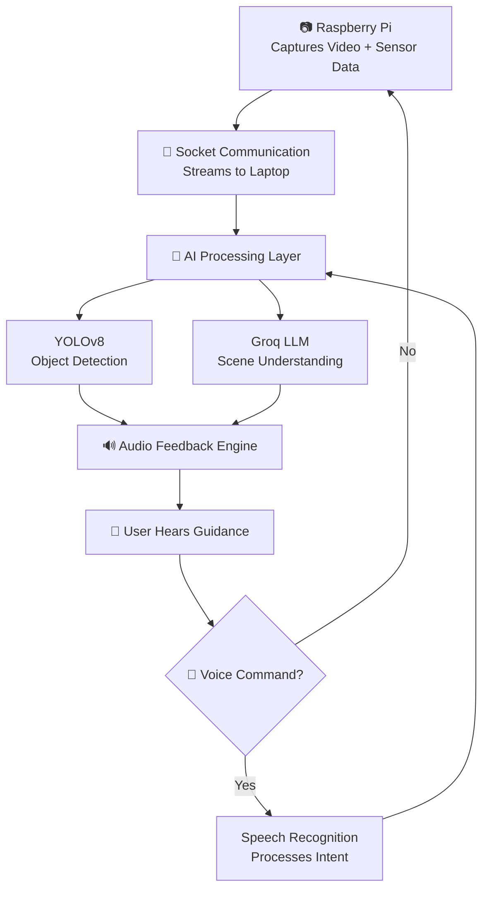

<div align="center">

<!-- Banner -->


<!-- Badges -->
<p>
  
  
  
  
  
</p>

<br/>

> **🦯 Empowering independence through AI-powered vision — turning every step into a guided experience.**

</div>

---

## 🧭 Table of Contents

- [What is VIAS?](#-what-is-vias)
- [The Problem](#-the-problem)
- [Our Solution](#-our-solution)
- [How It Works](#️-how-it-works)
- [Key Features](#-key-features)
- [Architecture](#️-architecture)
- [Tech Stack](#-tech-stack)
- [Challenges & Solutions](#-challenges--solutions)
- [Impact](#-impact)
- [Future Scope](#-future-scope)
- [Example Commands](#-example-commands)
- [Team](#-team)

---

## 🌟 What is VIAS?

**VIAS** *(Vision Intelligence Assistive System)* is an AI-powered assistive solution built for visually impaired individuals to navigate their surroundings **safely and independently**.

It fuses **real-time computer vision**, **sensor data**, and **natural voice interaction** to deliver intelligent, contextual awareness — not just obstacle detection, but genuine *environmental understanding*.

---

## 🚨 The Problem

<table>
<tr>
<td width="50%">

### For the User

- 🌑 &nbsp;Limited awareness beyond arm's reach
- 🚧 &nbsp;Unable to detect distant obstacles in time
- 🤷 &nbsp;No contextual understanding of surroundings
- 🦯 &nbsp;Traditional canes offer only basic, physical feedback

</td>
<td width="50%">

### For Existing Digital Tools

- ⏱️ &nbsp;Not working in real-time
- 👆 &nbsp;Require active manual interaction
- 🧱 &nbsp;Lack intelligent scene interpretation
- 💸 &nbsp;Often expensive or inaccessible

</td>
</tr>
</table>

---

## 💡 Our Solution

VIAS flips **passive assistance** into an **active intelligence system**:

```
Detect  →  Understand  →  Communicate  →  Act
```

| Capability | What VIAS Does |
|---|---|
| 👁️ **Real-time Vision** | Continuously scans surroundings using camera + YOLO |
| 🧠 **Scene Intelligence** | Groq LLM interprets the environment in plain language |
| 🔊 **Voice Feedback** | Instantly narrates obstacles, paths, and surroundings |
| 🎤 **Voice Commands** | Users query their environment naturally via speech |
| 🚨 **Emergency Response** | Fall detection triggers automatic SOS alerts |

---

## ⚙️ How It Works



### Step-by-Step Flow

```
① 📷  Raspberry Pi captures live video + ultrasonic/IMU sensor data
② 📡  Data streamed in real-time to laptop via socket connection
③ 🧠  YOLOv8 detects objects | Groq LLM generates scene description
④ 🔊  System converts output to audio and plays to user
⑤ 🎤  User speaks a command ("describe", "navigate", "call")
⑥ 🔁  System processes command, responds, resumes live monitoring
```

---

## 🔑 Key Features

<div align="center">

| Feature | Description |
|:---:|:---|
| 🚶 **Obstacle Detection** | Ultrasonic + computer vision fusion for near and far obstacles |
| 👤 **Object Recognition** | Identifies people, furniture, vehicles, and more |
| 🗣️ **Voice Interaction** | Fully hands-free speech query and command system |
| 🧠 **Scene Description** | AI generates natural language descriptions of surroundings |
| 🚨 **Fall Detection + SOS** | IMU-based fall detection with automatic emergency alerts via Twilio |
| 📍 **Voice Navigation** | Spoken route instructions powered by OpenRouteService |
| 📞 **Phone Control** | ADB-integrated call functionality triggered by voice |
| 🌍 **Multilingual Output** | gTTS + translation layer for regional language support |

</div>

---

## 🏗️ Architecture

```
┌─────────────────────────────────────────────────────────────┐
│                     RASPBERRY PI (Edge)                     │
│  ┌─────────────┐  ┌──────────────┐  ┌───────────────────┐  │
│  │  Camera     │  │  Ultrasonic  │  │   IMU Sensor      │  │
│  │  Module     │  │  Sensor      │  │  (Fall Detection) │  │
│  └──────┬──────┘  └──────┬───────┘  └────────┬──────────┘  │
│         └────────────────┼──────────────────┘             │
│                          ▼                                  │
│              Socket Streaming (TCP/IP)                      │
└──────────────────────────┬──────────────────────────────────┘
                           │
                           ▼
┌─────────────────────────────────────────────────────────────┐
│                  LAPTOP (AI Processing)                     │
│                                                             │
│  ┌─────────────────┐        ┌──────────────────────────┐   │
│  │  YOLOv8 Model   │        │      Groq LLM            │   │
│  │  Object Detect  │───────▶│  Scene Understanding     │   │
│  └─────────────────┘        └──────────────────────────┘   │
│           │                           │                     │
│           └──────────────┬────────────┘                     │
│                          ▼                                  │
│              ┌───────────────────────┐                      │
│              │   Speech Output       │                      │
│              │  gTTS / eSpeak        │                      │
│              └───────────┬───────────┘                      │
└──────────────────────────┼──────────────────────────────────┘
                           │
                           ▼
                    👤 USER FEEDBACK
              (Audio guidance through earphones)
```

---

## 🧰 Tech Stack

<div align="center">

### 🔩 Hardware


### 💻 Core Software


### 🤖 AI / ML


### 🗣️ Speech


### 🌐 APIs


-3DDC84?style=flat-square&logo=android&logoColor=white)

</div>

---

## ⚔️ Challenges & Solutions

| # | 🚧 Challenge | ✅ Solution |
|---|---|---|
| 1 | Real-time video streaming with low latency | Optimized socket communication protocol |
| 2 | Speech recognition cutting off mid-sentence | Tuned silence detection parameters |
| 3 | Managing vision, speech & control threads | Event-based sync using `speech_done` flag |
| 4 | AI generating overly verbose responses | Refined system prompts for concise output |
| 5 | Hardware-software synchronization | Modular, event-driven architecture |

---

## 🌍 Impact

```
┌──────────────────────────────────────────────────────────┐
│                                                          │
│   🏃 Independent Navigation   →   Reduces dependency    │
│   🦺 Real-time Safety         →   Prevents accidents    │
│   🧠 Context Awareness        →   Improves confidence   │
│   💰 Affordable Hardware      →   Scalable globally     │
│                                                          │
└──────────────────────────────────────────────────────────┘
```

> VIAS is not just a device — it's a **mobility multiplier** for the visually impaired community worldwide.

---

## 🚀 Future Scope

- [ ] 🛰️ Real-time GPS navigation with live location tracking
- [ ] 🔌 Fully offline AI processing (no cloud dependency)
- [ ] 👓 Integration into wearable smart glasses form factor
- [ ] 🗺️ Advanced obstacle-aware path planning
- [ ] 🗣️ Improved natural voice synthesis with emotional tone

---

## 🧪 Example Commands

```bash
# Describe current surroundings
"describe surroundings"

# Ask about what's directly ahead
"what is ahead"

# Start navigation to a saved location
"navigate to home"

# Trigger a phone call
"call"

# Cancel an active fall/SOS alert
"I am ok"
```

---

## 🏁 Conclusion

VIAS demonstrates how **AI, IoT, and human-centered design** can converge to build meaningful assistive technology that goes beyond gimmickry — creating real-world impact for people who need it most.

> *Making environments more accessible, intelligent, and inclusive — one voice command at a time.*

---

## 👥 Team

<div align="center">

| | Member |
|:---:|:---:|
| 👨‍💻 | **Avinash** |
| 👨‍💻 | **Amalhari** |

</div>

---

## 📌 Note

> This project is a **prototype** built during a hackathon. The architecture and feature set are designed to be extended into a **full-scale, production-ready assistive system**.

---

<div align="center">


*Built with ❤️ to make the world more accessible.*

</div>
